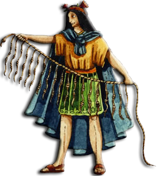
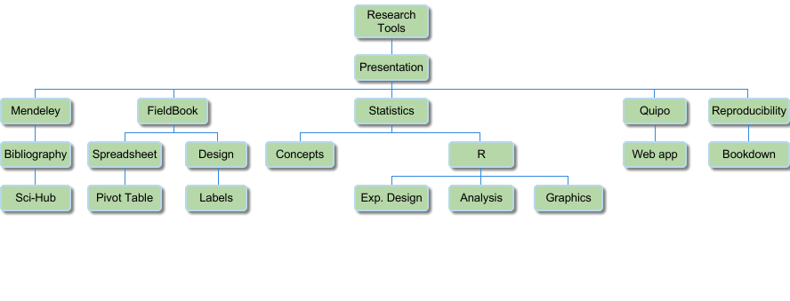

```{r setup, include=FALSE}

knitr::opts_chunk$set(
	echo = FALSE,
	message = FALSE,
	warning = FALSE
)

options(digits = 2)

library(fieldbook)
library(GerminaR)
library(agricolae)
library(knitr)
library(cowplot)
library(ggplot2)
library(png)
library(jpeg)
library(DT)
library(citr)

```


# Bienvenidos {-}


```{r cover, fig.align='center', out.width='50%'}

```

Quipu 2.0 es un guia para ayudar en el manejo y organización de diferentes tipos de experimentos en las areas de las ciencias agraria y biologicas con uso del software estadístico R.


# Por que leerlo? {-}

Si eres un persona que tiene curiosidad de comenzar una investigacion y no sabes como inciar tu parte experimental, esta guia sera de gran ayuda. A traves de este curso se ira describiendo en forma continua y de manera sensilla la metodologia de la investigacion experimental que puede ser extendidas a otras áres de estudio, con herramientas de aceso libre que seran de gran ayuda. Muchas de estas herramientas tienen como fundamento la ejucucion de codigos, pero no se asusten, ya que se transmitira los conocimientos de una manera facil con un lenguaje sencillo.


# Organigrama de temas {-}

```{r temas, fig.align='center', out.width='100%'}



# https://docs.google.com/spreadsheets/d/1_IZDac1jyBHidA7nvYZ_0NDnnW4foQQTYEmbLt7Zmvs/edit#gid=1705262123

```


# Syllabus {-}

## Datos generales {-}

**Programa		:** Herramientas para la Investigación Científica

**Requisito 	:** Métodos estadísticos

**Duración		:** 20 horas

<!-- **Fecha			  :** 27, 28, 30 de junio; 01 y 04 de Julio (5 días) -->

**Requerimiento	:** 

- Laptop
- Gmail account (recomendado)

## Justificación {-}

El desarrollo tecnológico e industrial de los países se basa en la investigación en las áreas de ciencias básicas y aplicadas. Por lo que es importante saber las herramientas para el planeamiento, manejo, análisis e interpretación de información colectada durante los procesos de investigación. Una de las mayores deficiencias para el desarrollo de la investigación es el desconocimiento de dichas herramientas que dificultan el proceso de investigación generando colecta errada de datos e inferencias no acordes a la realidad. Actualmente existen muchas herramientas para el planeamiento y análisis de datos, cuyos costos son muy elevados e inaccesibles para muchos estudiantes y profesionales. En este curso se harán uso de herramientas basados en código libre con amplia aplicación en diferentes ramas de las ciencias que faciliten los procesos de investigación.

## Objetivos {-}

- Aprender la planificación y manejo de experimentos bajo distintos diseños estadísticos (DCA, DBCA, FACTORIAL).

- Aprender el uso de herramientas para el análisis estadístico con el software R.

- Comprender los análisis estadísticos e interpretación de resultados estadísticos.

- Desarrollo de gráficos estadísticos en R. 

- Usar herramientas para facilitar la redacción científica.


## Cronograma y contenido de curso {-}


```{r}

cronograma <- data.frame(
  
   "Horas" = c(
    
    4, "", "",
    4, "", "", 
    4, "", "",
    4, "", 
    4, "", ""
    
    ),

  
  "Contenido" = c(
    
    "Presentación y requisitos del curso",
    "Lenguaje R y uso de librerías",
    "Tipos de variables",
    
    "Importación de base de datos a R",
    "Manipulación, organización y visualización de datos",
    "Resumen de base de datos", 
    
    "Metodología de investigación científica",
    "Planteamiento y diseño de libro de campo",
    "Colecta e importación de datos",
    
    "Conceptos basicos de estadistica",
    "Modelos y diseños experimentales",
    
    "Gráfica de resultados de análisis estadísticos",
    "Análisis multivariado",
    "Presentacion de la aplicación fieldbook"
    
    )

)


knitr::kable(
  cronograma,
  #caption = "Cronograma de curso",
  align = "l",
  booktabs = TRUE
  )

```


## Softwares {-}

- [R](https://cran.rstudio.com/)
- [R Studio](https://www.rstudio.com/products/rstudio/download/)
- [Mendely](https://www.mendeley.com/)
- [Github desktop](https://desktop.github.com/)

## Requerimientos técnicos {-}

- Conexión a internet
- Enchufes para cargar laptops
- Proyector Multimedia
- Pizarra


