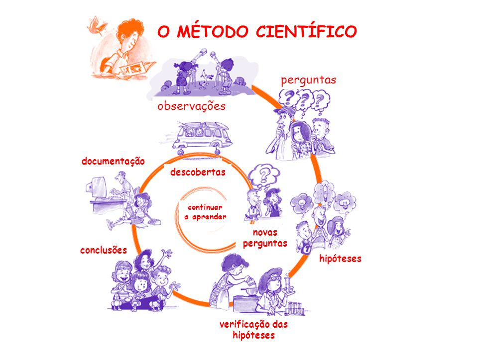

# Introducción

## Método científico

Siempre nos estamos haciendo preguntas de las cosas que suceden a nuestro alrededor, para responder a esas inquietudes de forma sistemática, se hace uso del método científico. El método científico se incia con una observacion de algo que nos llamas la atencion, lo que genera preguntas. Con las preguntas que nos realizamos podemos sugerir hipotesis de por que esta ocurriendo dicho fenómeno, por lo que se recurre a una forma de comprobar la hipotesis a traves de un experimento, donde rechazaremos o damos como cierta nuestras hipotesis, dando como resultado informacion que nos llevará a generar nuevas información, muchas veces en esta etapa concluye la investigación, debido a que pocos documentan los resultados. Si los resultados son publicados se generará nuevas ideas o descubrimientos, lo cual generará nuevas preguntas a otras personas que deseen seguir explorando dicho tema y es ahi donde se genera el conocimiento, Figura \@ref(fig:metcien).

```{r metcien, fig.cap = "Pasos del método científico", fig.align='center', out.width='80%'}

```


## La investigación y la publicación

La investigación científica y la publicación del artículo científico son dos actividades intimamente relacionadas. Algunas personas creen que la investigación termina cuando se obtienen los resultados, cuando estos se analizan, cuando se entrega el informe del trabajo o cuando la investigación se presenta en una reunión profesional. Sin embargo, la investigación científica formal y seria termina con la publicación del artículo científico; solo así tu contribución pasará a formar parte del conocimiento científico. Algunas personas van más lejos y sugieren que la investigación termina cuando el lector entiende el artículo; es decir, que no basta con publicar el trabajo, también es necesario que la audiencia entienda claramente su contenido [@mari2005manual]. Un análisis brillante resulta inutil si los resultados no son comunicados en lenguaje sencillo y claro [@Gonick1993]. Para escribir un buen artículo científico tienes que conocer y practicar los tres principios básicos de la redacción científica:  precisión, claridad y brevedad. 

## Problemas comunes en la investigación

Uno de los principales problemas que se pude observar a disitintos niveles, tanto en estudiantes como en investigadores, es la falta de organización y orden no sólo en las bases de datos, si no en la forma de ejecucion de sus experimentos. Un experimento al ser parte de un plan de trabajo debe ser planificado con anticipacion y tratar de reducir al minimo las posibles los errores o sincronizacion de los tiempos en las evaluaciones y toma de dato. Sumado a este problema los investigadores no suelen tener un diario para hacer anotaciones de sus trabajos, esto junto a la mala colecta de la información, que usualmnete son en hojas de calculo excel, genera un situacion cada vez más engorroza en la etapas posterioes como el analisis de datos y presentacion de los resultados.
