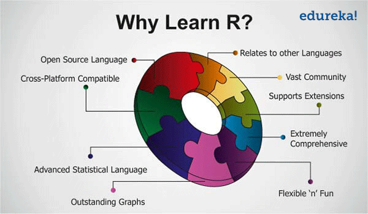
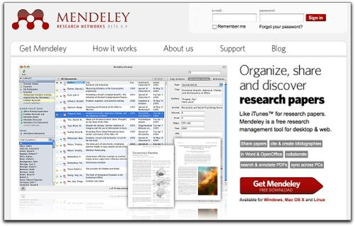
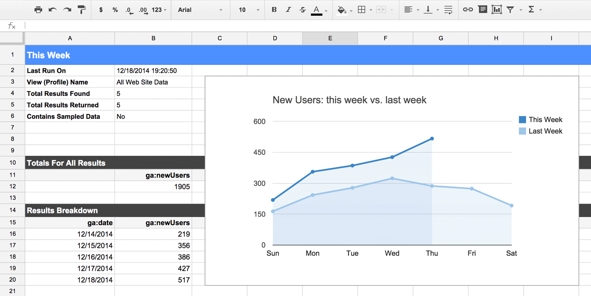
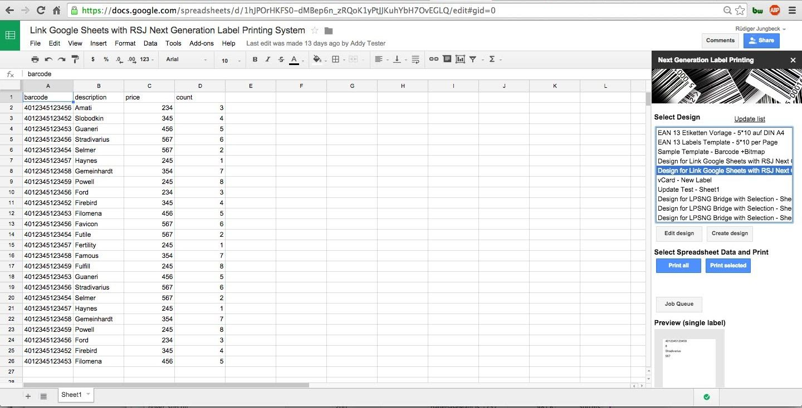
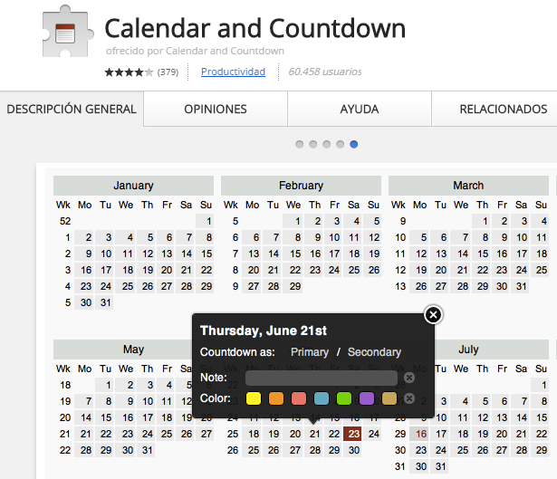

# Softwares y aplicaciones

Los software que se harán uso en este guía, son de distribucion gratuitas o de codigo abierto, con esto se quiere fomentar la reducción del uso de software pirata y los costos de licencias de softwara de pago. 

## Software estadistico R

En el año 1992, los investigadores **Ross Ihaka y Robert Gentleman**, ambos de la Universidad de Auckland, Nueva Zelandia, desarrollaron un software para el analisis estadistico y le atribuyeron el nombre de software R, el cual fue basado en el lenguaje de programacion _S_, inicialmente desarrollado en los laboratorios de _AT&T Bell_ a mediados del año 1970 [@calenge2006package]. 

Cuando  R. Ihaka e R. Gentleman lanzaron el software R, le atribuyeron funcionalidad de ser de código abierto [@Ihaka2012], lanzando la plataforma "Comprehensive R Archive Network (CRAN)", que es el nucleo donde se hospeda la mayoria de los paquetes del software R. El CRAN es una comunidad cada vez creciente y es el principal repositorio de material relacionado a R [@Hornik2002].

Desde su creacion, R paso a ser un lenguaje de programación y ambiente para el análisis estadistica computacional y generación de graficos. El software R da una amplia variedad de análisis estadisticos, tales como, modelaje lineal y no lineal, testes estadisticos clasicos, análisis de series temporales, clasificacion, cluster y técnicas graficas, todas de alta reporductivilidad. R fue desarrollado en un entorno de lenguaje de programacion legítima, y permite a los usuarios adicionar nuevas funcionalidades de acuerdo a sus necesidades. Las funcionalidades de R pueden ser extendidas a traves de paquetes para desarrollar ciertas funciones determinadas. Actualmente existen 8 paquetes básicos fornecidos por la distribucion de R y otras tantas estan disponibles a traves del CRAN, con servidores en la internet que cubren una amplia gama de herramientas estadisticias modernas [@R-base].

```{r wayr, fig.align='center', out.width='80%', fig.cap= "Por que usar R?"}

```


## R studio

RStudio es un entorno de desarrollo integrado (IDE) para R. Incluye una consola, editor de resaltado de sintaxis que soporta la ejecución directa de código, así como herramientas para graficar, historial, la depuración y la gestión del espacio de trabajo. RStudio está disponible en codigo libre y ediciones comerciales y se ejecuta en el escritorio (Windows, Mac y Linux).

> "RStudio makes R easier to use. It includes a code editor, debugging & visualization tools. RStudio (2017)"

**Principales caracterisitcas**

- Integracion a la ayuda y documentación de R.
- Administrar fácilmente múltiples directorios de trabajo mediante proyectos.
- Navegador de espacio de trabajo y visualizador de datos.
- Ejecutar código R directamente desde el editor fuente.
- Saltar rápidamente a las definiciones de funciones.
- Extensas herramientas de desarrollo de paquetes.
- Redacción de documentos cientificos.

```{r rstudio, fig.align='center', out.width='70%', fig.cap="Interface de RStudio"}
knitr::include_graphics("img/rstudio.png")
```

## Mendeley

Mendeley es un gestor de referencia gratuito y una red social académica que ayuda en la organizar de las investigaciones, colaborar con otros en línea y descubrir las últimas investigaciones.

**Principales caracterisitcas**

- Generar automáticamente bibliografías.
- Colaborar fácilmente con otros investigadores en línea.
- Importar fácilmente documentos de otro software de investigación.
- Encuentrar documentos relevantes basados en lo que está leyendo.
- Acceder a sus documentos desde cualquier lugar en línea.
- Leer documentos sobre la marcha, con las aplicaciones para dispositivos moviles.

```{r mendeley, out.width='50%', fig.show='hold'}
knitr::include_graphics("img/mendeley.jpg")

```


## Google spreadsheets

Google spreadsheet es un servicio vía web de hojas de cálculo, realizado en tecnología _AJAX_. Con ella se puede realizar la mayoría de las funciones que dejan las aplicaciones de hojas de cálculos de los programas ofimáticos (microsoft office, open office, etc), como realizar operaciones entre celdas con diferentes tipos de funciones (matemáticas, financieras, lógicas, de fechas, de búsquedas, estadísticas, con cadenas e informativas), ordenar columnas, manejar diferentes hojas dentro de cada fichero, manejas ficheros del tipo _xlsx_ y _csv_, etc. 

**Principales usos**

1. Organización y colecta de datos.
1. Tablas dinámicas.
1. Generacion de etiquetas.

```{r gss, out.width='80%', fig.align='center'}

```


## Next Generation Label Printing System

**RSJ Next Generation Label Printing System** es una aplicacion para facilitar la creación e impresión de etiquetas que contienen datos suministrados directamente en su navegador y como componente de las hojas de calculo de google spreadsheet.

```{r nglsp, out.width='80%', fig.align='center'}

```

## Calendar and Countdown

Aplicacion para google chrome que muestra el calendario de año completo y permite añadir notas, colores a los días, y comprobar la distancia entre ellos.

**Características**

* Icono seleccionable por el usuario con la cuenta regresiva activa.
* Personalizaciones de calendario.
* Información sobre herramientas con fecha de hoy.
* Popup muestra cuán lejos está el día seleccionado.

[](https://chrome.google.com/webstore/detail/calendar-and-countdown/caplfhpahpkhhckglldpmdmjclabckhc){target="_blank"}
 


